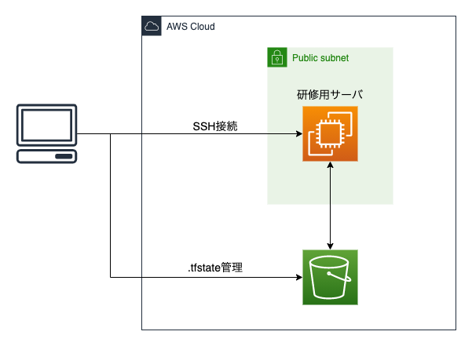

# AWS と Terraform による研修・ハンズオン環境用構築

研修用に AWS 環境の構築を Terraform で自動化  
作成する AWS 環境の構成図は下図の通り



## 必要条件

- Terraform, AWS CLI が利用可能であること

※稼働確認は以下の通り

- macOS Catalina: v10.15.7
- Terraform: v0.14.8
- AWS CLI: v2.1.5

## 手順

1. 管理者権限を持つ IAM ユーザを作成する

   - 研修用の AWS アカウントで操作する
   - 管理者権限ポリシー(arn:aws:iam::aws:policy/AdministratorAccess)を持つ IAM ユーザを作成する
   - 作成時「プログラムによるアクセス」はチェックし、「AWS マネジメントコンソールへのアクセス」はチェックしない
   - 作成後に表示される認証情報を保存 or メモしておく

1. aws configure で AWS 認証情報を設定する

   ```sh
   aws configure --profile aws-training
   AWS Access Key ID [None]: # 前項で作成したIAMユーザのAWS Access Key IDを設定
   AWS Secret Access Key [None]: # 前項で作成したIAMユーザのAWS Secret Access Keyを設定
   Default region name [None]: ap-northeast-1
   Default output format [None]: json
   ```

1. 研修受講者のユーザ名一覧を設定する

   - data/users/user_list.txt にユーザ名一覧を改行区切りで設定します
   - ここで設定したユーザ名のユーザが EC2 インスタンス上で作成されます

1. 初期化処理

   ```sh
   ./initialize.sh
   ```

1. AWS リソースを作成する

   ※環境作成後は課金が発生する場合があります(デフォルトであれば初年度無料枠範囲内に収まります)

   ```sh
   terraform apply --auto-approve
   ```

   - デフォルトでは`aws-training-[AWSアカウントID]`の名前で S3 バケットが作成されます
   - 作成が完了すると研修用 EC2 インスタンスのパブリック IP アドレスが表示されるのでメモしておきます

1. 研修受講者用の秘密鍵を取得する

   - 研修受講者が EC2 インスタンスに SSH アクセスするための秘密鍵を取得します
   - 以下のコマンドでローカルにディレクトリをコピーするため、各受講者に配布します

   ```sh
   host_ip=[前項でメモしたIPアドレス]
   scp -r -i data/ssh/training-server ec2-user@${host_ip}:/home/ec2-user/tr_users_keys .
   ```
